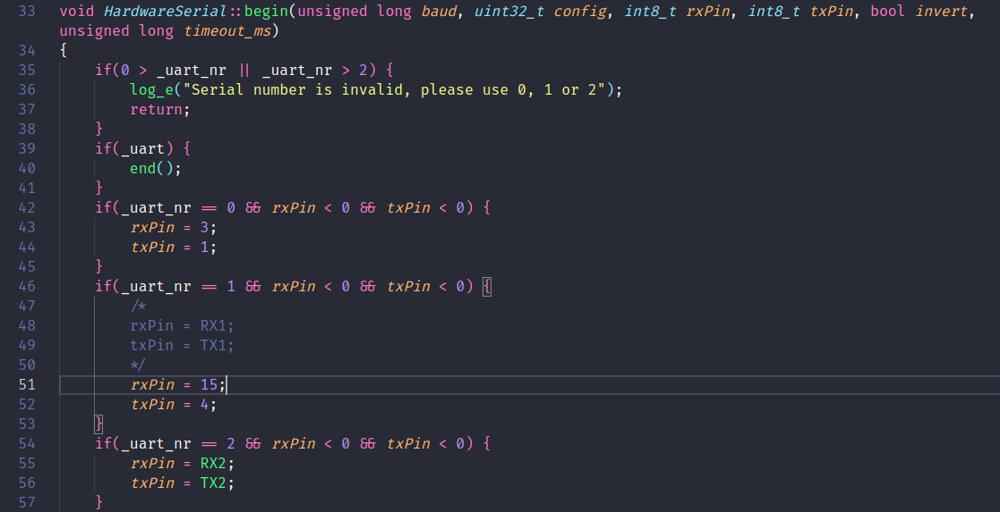

## Testando todas as seriais disponíveis no ESP32

No ESP32, as portas serial hardware são denominadas Serial0 e Serial2. Cada uma delas possui pinos específicos associados para a comunicação. Aqui estão os pinos correspondentes para cada porta serial:

#### Serial0 (Porta Serial Padrão):
- RX: Pino 3 (GPIO3 / Rx0)
- TX: Pino 1 (GPIO1 / Tx0)

#### Serial2:
- RX: Pino 16 (GPIO16 / Rx2)
- TX: Pino 17 (GPIO17 / Tx2)

#### Serial1:
Para o uso da Serial1, temos que mudar a definição dos pinos na biblioteca HardwareSerial.cpp.

PATH da biblioteca no linux:

```
/home/engenheiro/.arduino15/packages/esp32/hardware/esp32/1.0.6/cores/esp32/HardwareSerial.cpp
```

A imagem abaixo mostra a mudança que deve ser realizada.

Perceba que os pinos escolhidos foram o 15 e 4, mas poderiam ser outros também.


